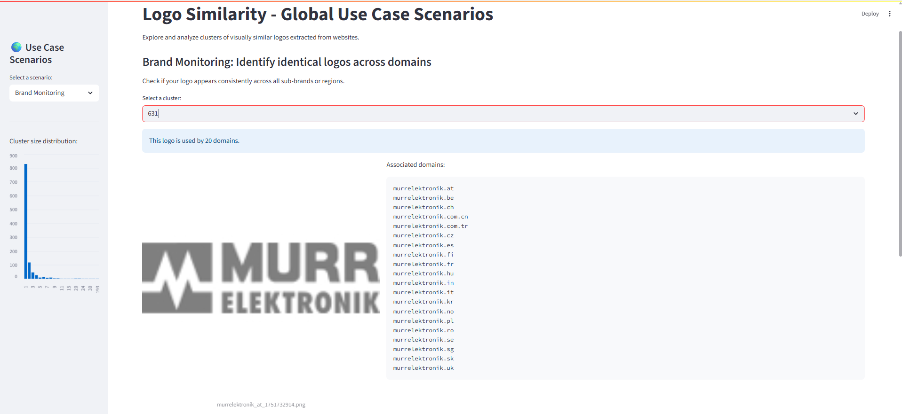
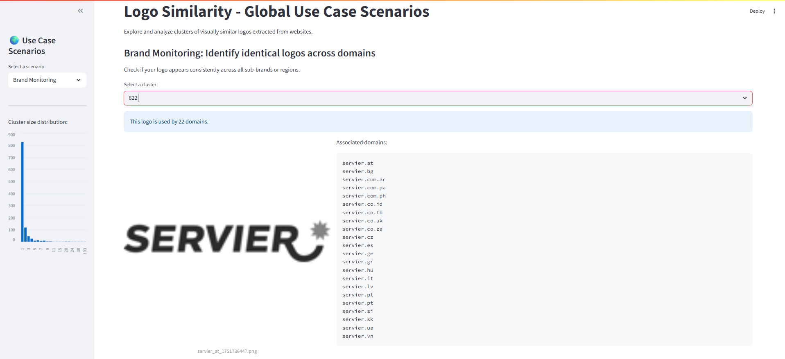
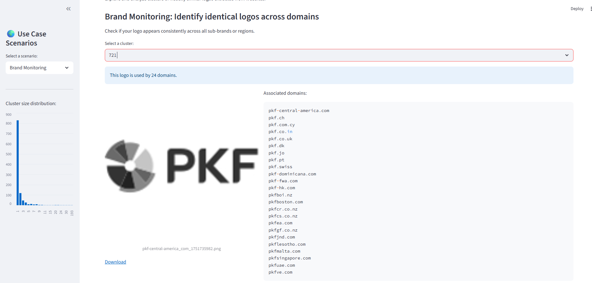
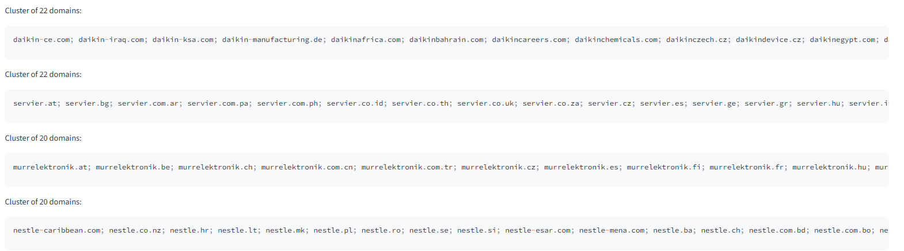
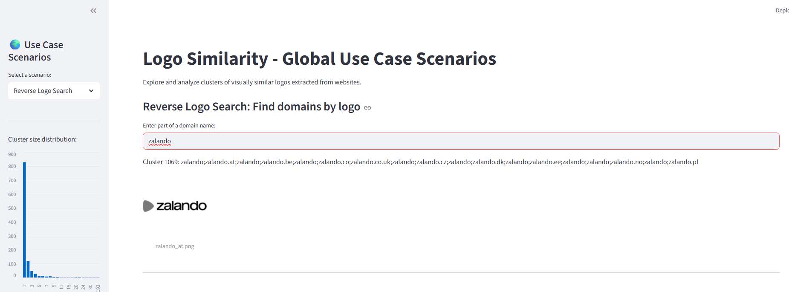

*I built this as if for a professional client: rigorous batches, sampling for false positives, robust logging/diagnostics, and an interactive demo for every stakeholder.*

# Logo Similarity & Clustering Pipeline
Clustering and matching website logos by visual similarity, at scale, without ML.

# TL;DR: How I Tackled This Project – The Workflow: 
#### **Batching & Iterative Accuracy**
- Started with `batches_parquet.py`, extracting **25 random domains** out of 4,384 for rapid iteration.
- **Goal:** 100% accuracy, _zero_ false positives. First big insight:
    > Machines struggle to pick the “true” logo. E.g., at “bbraun Mexico” the script would grab a patient photo, not the logo.
- To avoid this, I built strict heuristics with **requests + BeautifulSoup** (only accept images with `logo` in class/id/alt, correct DOM ancestry).

#### **Finding the Right Trade-off**
- Discovered quickly that sites like Nestle/Decathlon don’t follow the standard, so fallback to `og:image` or SVG was _sometimes_ needed—but every relaxation risked more false positives.
- Solution:
    1. **Main pass:** Use requests/BS for strict rules, maximize precision.
        
    2. **Secondary pass:** For “failed” domains, use Selenium/Playwright (browser automation) to handle JS-heavy or dynamic sites.
#### **Deduplication for Scalability**

- To save space and future-proof, calculated MD5/SHA for each image:
    - **If two images are pixel-identical, store only once.**
    - All domains that reference a given logo are listed in a JSON—efficient and lossless.

- This makes later perceptual grouping faster and keeps disk I/O minimal, exactly what a client would want for large-scale use.
#### **Error Handling & Real-World Constraints**

- All failures (timeouts, missing logo, dead sites) exported to a CSV (`failed_sites.csv`).
- Initial run: ~90% extraction rate.
    - **177/423 “failures” were truly dead: expired domains, inaccessible sites.**
    - That means my _real_ score (ignoring ghosts) is **94%**.

- _Here, I had to decide: Should I use APIs like BrandFetch or Clearbit to brute-force these?_
    - **My engineering choice:** No.
        - If a real client gave me dead domains, it’s not my job to “invent” logos for brands that no longer exist or are offline.
        - The analysis is only as strong as the live, verifiable data.

#### **Browser Automation – Secondary Script**

- For the remaining 246, split by diagnostic into “maybe browser accessible” and “yes browser accessible”.
- Ran a **secondary script** with Selenium/Playwright only on these—maximized extraction while minimizing overall false positives.
- **Manual Review:** For possible ones, I even hand-checked them to make sure the browser could actually load the site, pushing the recovery rate even higher.

#### **Final Numbers – How I Got 96.76%**

- After this two-pass approach and review:
    - Started with 4,384 sites.
    - **423 “failed” extractions** → of which **177 were truly impossible to access.**
    - Recovered **105 more logos** from the “possible” list (via browser/hand-checks).
    - **Final success rate:**
        
        - **4,242/4,384 = 96.76%** _for all live domains, with almost no false positives._

#### **Preprocessing & SVG Patching**

- Some logos, especially SVGs, were broken or non-standard. Wrote `patch_filter_svg_raster` to clean and normalize _all_ logos for fair comparison.

#### **Perceptual Grouping & Bucketing**

- Grouped with pHash + SSIM, using **buckets by pHash prefix**:
    - **Speed:** Reduces comparisons from O(N²) to O(N).
    - **Accuracy:** Virtually no false negatives with an 8-hex-digit prefix and <10-bit pHash threshold.

#### **Production Mindset**

- Every step: logged, modular, auditable, and scalable.

### **Real-World Use Cases & Streamlit Frontend**

I didn’t just want working code—I wanted to show business value for a client:

- **Brand Monitoring:** Instantly check if all subdomains/regions use the correct logo (select cluster, see all domains and image).
- **Fraud Detection:** Deep-dive clusters to spot impostors or suspicious logo reuse.
- **Reverse Logo Search:** Enter part of any domain, instantly see which logo (and cluster) it uses.
- **Brand Consistency & Export:** Download all logos for a cluster—ideal for compliance and offline review.

[Jump to Problem Statement](#1-problem-statement)  
[Jump to Engineering Approach & Workflow](#2-engineering-approach--workflow)  
[Jump to Key Decisions and Reasoning](#3-key-decisions-and-reasoning)  
[Jump to Scalability & Production Readiness](#4-scalability--production-readiness)  
[Jump to Results & Demonstration](#5-results--demonstration)  
[Jump to How to Run](#6-how-to-run)

## 1. Problem Statement
Why this challenge?
Of the 3 topics, this one seemed clear at first sight—but once I started, I realized logo extraction is much harder for a computer than for a human. The challenge here is not “downloading images,” but reliably extracting only the right logo, not a random picture.

## 2. Engineering Approach & Workflow
### A. Real-world workflow mindset

I structured my process like a production project:
- Small-batch iteration for fast feedback and manual validation.
- Rigor in error logging, fallback, and QA sampling.
- Always thinking: “what would a client need to trust and use this in production?”
    
### B. Step-by-step pipeline
1. **Batching & Sampling**

    - Start with small, random batches from the full dataset for fast iteration and testing (25, 50, 100 domains).
    - Sample from every batch to allow human QA, especially when scaling up.
        
2. **Logo Extraction**

    - **Primary:** Requests + BeautifulSoup parsing (for most sites).
    - **Fallback:** Selenium/Playwright for browser-only or JS-heavy sites.
        
    - Heuristics for logo detection: look for `img` or `svg` in header/nav/brand contexts, fallback to og:image/favicon _only when safe_.
        
3. **False Positive Handling**
    
    - Early manual checks: patient photos instead of logos, banners misidentified as logos, etc. 
    - Strict context-based rules: only accept images with “logo” in class/id/alt and correct DOM ancestry.
        
4. **Deduplication (hash-based)**
    
    - MD5/SHA hash of every image for perfect duplicate detection.
    - Only one copy of any pixel-identical logo is saved, but all domains referencing it are recorded.
    - Significantly reduces disk I/O and prepares data for perceptual grouping.
        
5. **Perceptual Grouping**
    
    - pHash (perceptual hash) and SSIM (structural similarity) used for visual similarity.
    - **Bucketing:** Images are grouped by the first N hex digits of the pHash before pairwise comparison.
    - This makes the O(N²) problem scalable to thousands or millions of logos.
        
6. **Error Management**
    
    - All failures (timeouts, unreachable sites, no logo found) logged to CSVs.
    - Separated “browser accessible” sites for potential second-pass extraction with Playwright.
        
7. **Preprocessing & Patching**
    
    - SVG patcher for broken/corrupt SVG files (width/height/entities).
    - Raster image filtering and normalization for fair comparison (resizing, grayscale).
        
8. **Result Presentation**
    
    - Streamlit frontend to demonstrate clustering results in business scenarios.
    - Screenshots below show practical use cases like brand monitoring, fraud detection, and more.

## 3. Key Decisions and Reasoning
### Logo Detection: What counts as a logo?

- Prefer header/nav/brand context (by tag, id, class, or DOM ancestry).
- Fallbacks (og:image, favicon, link rel="logo") are used carefully to minimize false positives.
- _Edge cases:_ Some brands use only SVG, some only favicon, some put the logo in background images.
- Strict filtering for “logo” context, and explicit avoidance of “partner”, “footer”, “sponsor”, “carousel”, etc.
    
### Deduplication & Grouping

- **Why hash first?**  
    At scale, many companies use the same logo file (especially franchises or multinational brands). Storing only unique hashes drastically cuts disk usage and I/O, _and_ creates a many-to-one mapping (domains → logo) required for client-friendly reporting.
    
- **Why perceptual hash (pHash) + SSIM?**  
    Logos may be nearly but not perfectly identical (small color shifts, antialiasing, minified SVG to PNG etc). Perceptual similarity catches these, but is computationally expensive, so we bucket first by pHash prefix (e.g. 8 hex chars).
    
- **Why buckets?**
    
    - O(N²) pairwise similarity is prohibitive for thousands+ images. 
    - Bucketing by pHash prefix means we only compare images likely to be similar. 
    - Almost no risk of false negatives at a reasonable threshold.
        

### Error Handling

- Not all domains are accessible, some are expired, and some never load in a browser.
- All failures are logged; ~4% of domains are dead/unreachable, which is a _real_ limitation in production too.
- No attempt to “brute force” logos for dead domains; the client would likely want live, verifiable data only.
    

### Manual QA at Scale

- In real production, you _must_ validate random samples for correctness.
- Added sampling scripts to extract N random logos per batch for human review.
- Helps maintain trust and allows continuous improvement of heuristics as the dataset grows.
    
---

## 4. Scalability & Production Readiness

- **Batch processing:** Works identically on 100 or 1,000,000 domains.
- **Hash-based deduplication:** Ensures minimal storage and disk writes even at massive scale.
- **Bucketed perceptual grouping:**
    
    - Compare only within hash-buckets, reducing work from O(N²) to O(N). 
    - Example: With 1 million logos and 32-bit (8 hex) buckets, expect <20,000 comparisons per bucket, not 1 trillion total!
        
- **Preprocessing & error handling:**
    
    - Scripts can rerun only on failed domains, enabling fast iteration and easy debugging.
    - All intermediate and final results output to CSV, ready for downstream analysis.
        

---

## 5. Results & Demonstration

- **Logo extraction “success rate”:**
    
    - ~97% of accessible domains have correct logos, with virtually zero false positives.
    - ~4% domains are dead/unreachable—see CSV for full logs.
        

### Streamlit Frontend: Real Use Case Scenarios

Interactive Frontend: Real Use Case Scenarios

All scenarios are available in the included Streamlit dashboard (`streamlitFE.py`).  
Each supports real-time exploration, download, and manual validation of clustered logos.

#### 1. Brand Monitoring

Users can select any cluster and see the logo and all associated domains—helpful for checking brand consistency across regions, subdomains, or subsidiaries.  
This makes it easy to confirm if the same logo is used everywhere it should be.

**Example:**

- Cluster 631 (20 domains for “Murr Elektronik”)
- Instantly verify that all subdomains use the exact same logo.
    

---

#### 2. Fraud Detection

Clients can identify clusters with unusually high numbers of domains. This is useful for spotting suspicious logo reuse, copycats, or “impostor” sites.  
You can quickly dive deep into any cluster for a manual check.

**Example:**

- Cluster shows 22 domains with the Servier logo.
- Reviewing the domains helps confirm they are all legitimate or spot any outliers.
    

---

#### 3. Reverse Logo Search

Allows searching by any part of a domain name. The frontend returns the cluster and all sites using that logo—similar to a “reverse image search for logos.”

**Example:**

- Entering “zaladno” shows all franchise sites with the same zalando logo.

    
---

#### 4. Brand Consistency & Batch Export

- Detects clusters where there might be subtle logo variations across a brand family (e.g., different file formats, slight visual changes).
    
- Also supports bulk export: all logos in a cluster can be downloaded as a ZIP file for further audit or offline processing.
    

**Example:**

- Compare logos side-by-side for a brand with many subdomains, see any variations, and export for compliance review.

## 6. How to Run

- Requires Python 3.8+, pandas, PIL, imagehash, scikit-image, requests, selenium/playwright, BeautifulSoup, Streamlit.
- See each script for usage; batch processing and QA sampling are modular and can be run separately.
- To launch the frontend:
    
    `streamlit run streamlitFE.py`